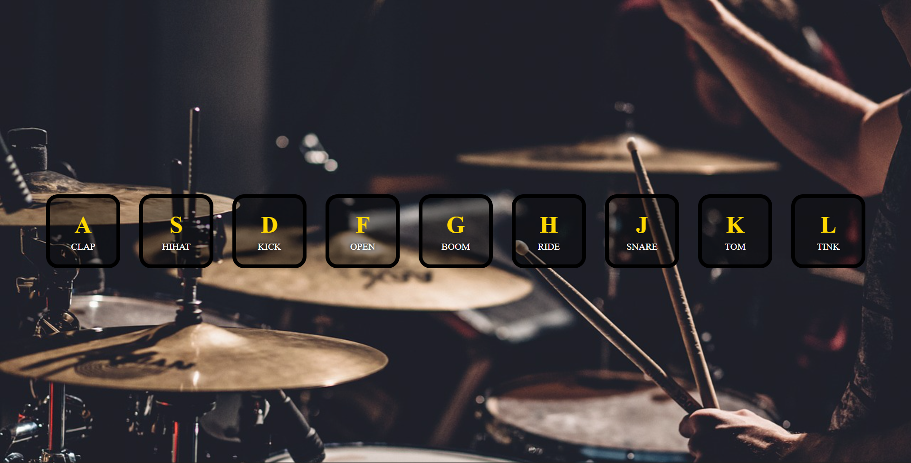

# Drum Kit Web App

An interactive drum kit web app that plays different sounds when users click buttons or press keys.

## About

This is a browser-based drum kit app built using HTML, CSS, and JavaScript.  
Users can play drum sounds by clicking on drum buttons or pressing corresponding keyboard keys.  
I built this project to practice handling keyboard and mouse events, working with audio in JavaScript, and creating interactive UI elements.

## Built With

`HTML` `CSS` `JavaScript` `Web Audio`

## What I Learned

- How to handle keyboard and click events and play audio dynamically using JavaScript.

## Links

- [Live Demo](https://snehashrestha123.github.io/Drum-Web/)
- [Source Code](https://github.com/Snehashrestha123/Drum-Web)
